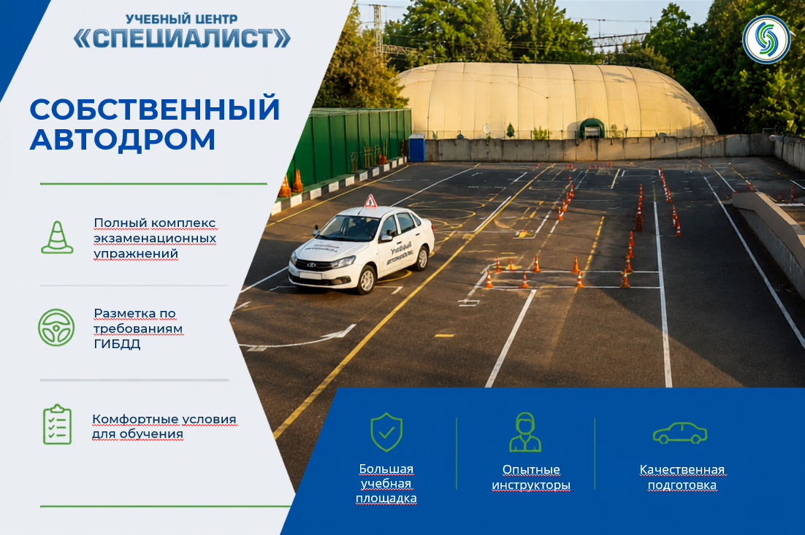
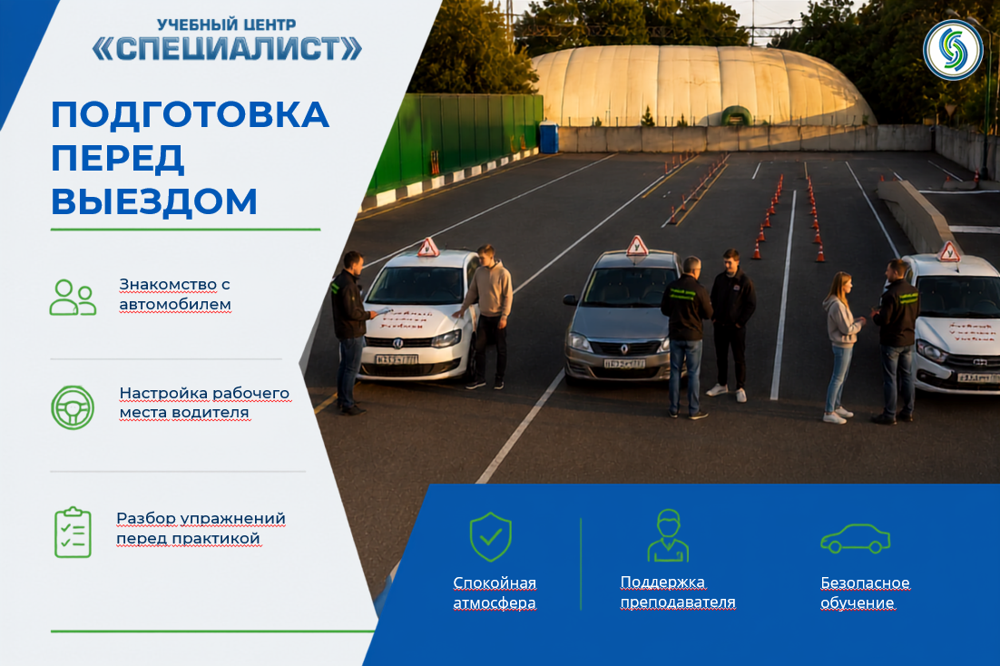
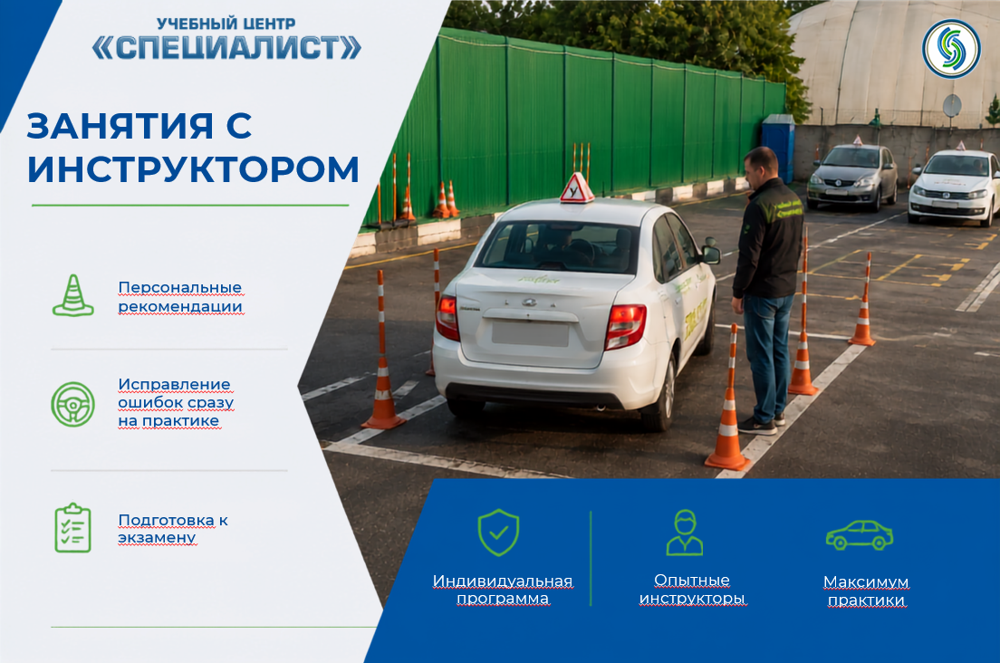
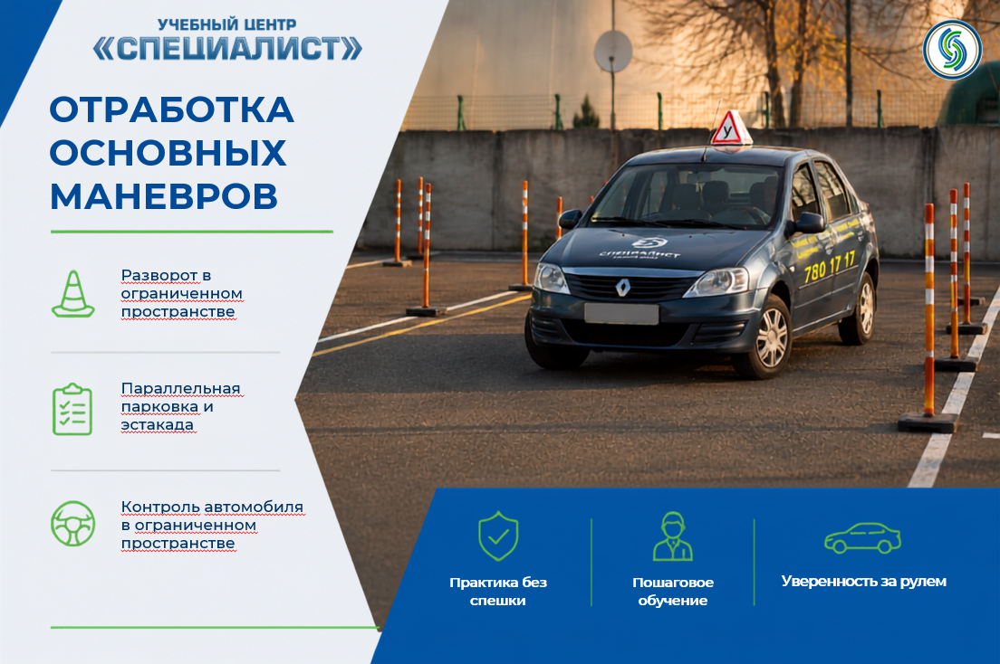
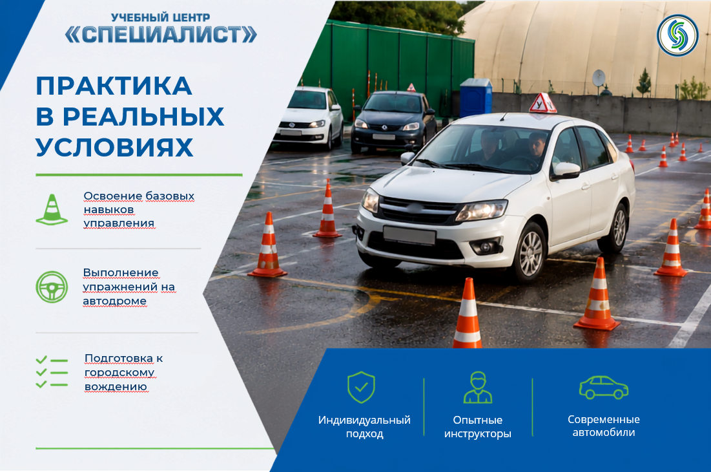
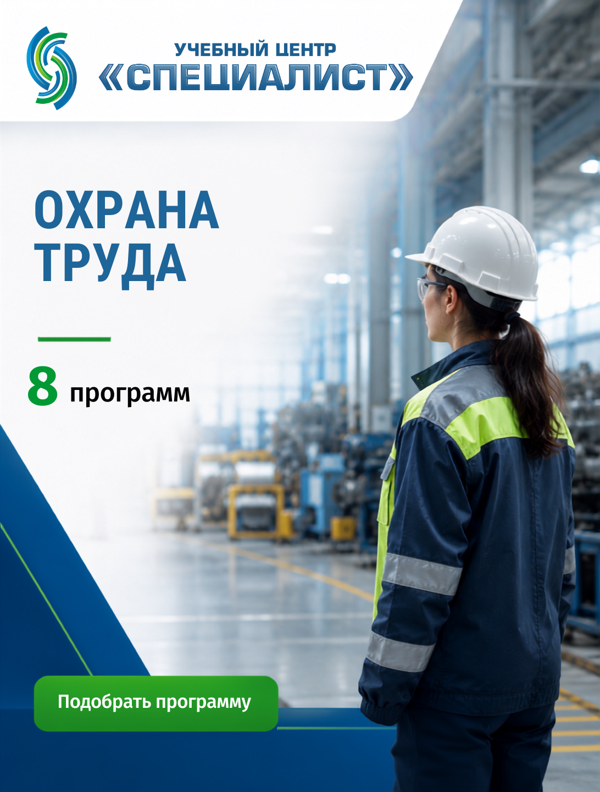
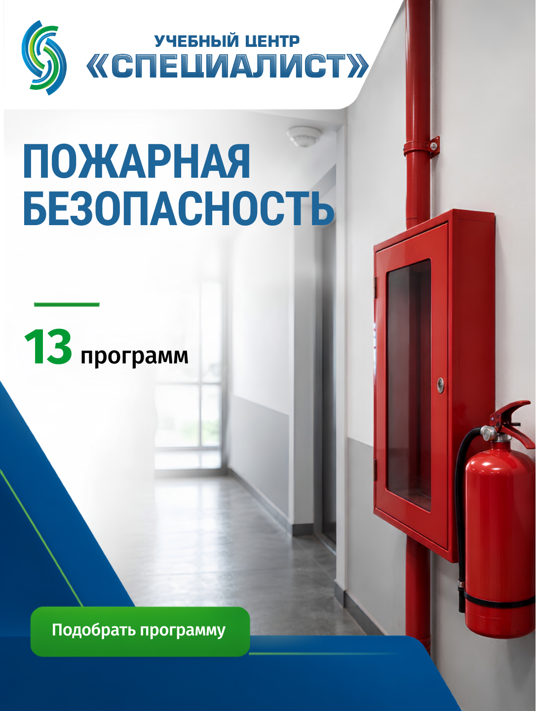
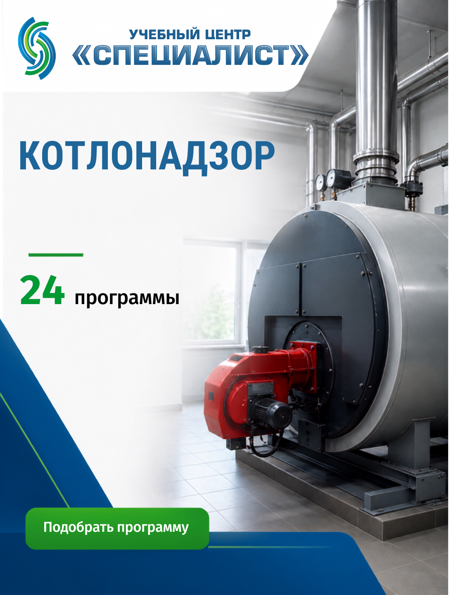
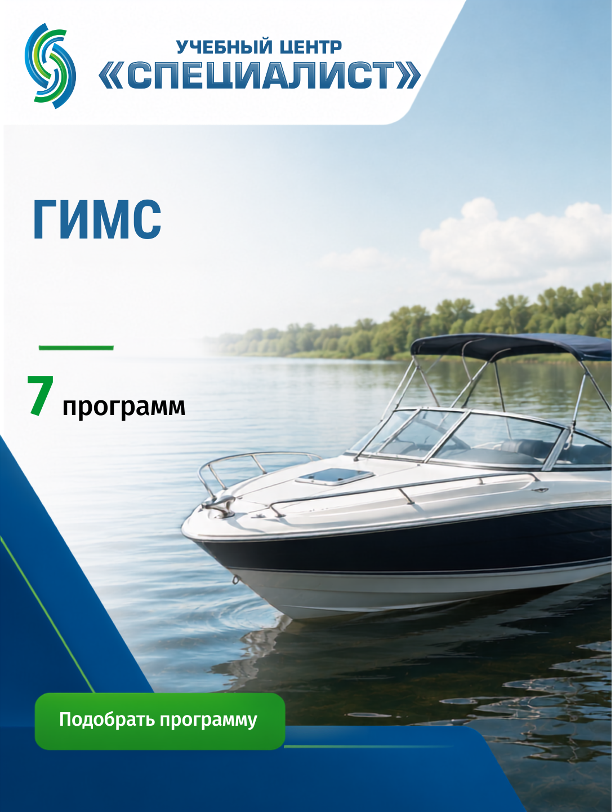

# EduFrame — Тексты для сайта

---

## 1. Первый экран — Кто мы

От первого интереса к курсу до успешного обучения.

**EduFrame**

Бюро образовательных коммуникаций

Мы помогаем образовательным организациям создавать современную систему обучения — от привлечения будущих слушателей до качественного образовательного процесса.

[Обсудить проект]

---

## 2. Какие задачи мы решаем

### Для руководителя

- **Привлечь больше слушателей.** Создаём маркетинговые материалы, которые работают на набор на программы.
- **Современно оформить программы.** Обновляем презентации, методические пособия и визуал до актуальных стандартов.
- **Разгрузить преподавателей.** Берём на себя подготовку учебных материалов, чтобы преподаватели сосредоточились на преподавании.
- **Создать единый стиль обучения.** Все материалы — от рекламных роликов до рабочих тетрадей — выдерживают один визуальный и содержательный стиль.

### Для преподавателя

- **Подготовить качественное занятие.** Получить готовый комплект материалов к каждому занятию.
- **Создать презентацию.** Современная, структурированная презентация, которая удерживает внимание.
- **Сделать видеоурок.** Профессиональный видео контент для дистанционного обучения.
- **Подготовить тесты и раздаточные материалы.** Всё необходимое для проверки знаний и самостоятельной работы.

---

## 3. Почему EduFrame

Отдельные материалы не решают задачу.

Работает только система, в которой маркетинговые и учебные материалы дополняют друг друга.

Мы не просто делаем презентации или ролики. Мы проектируем систему образовательных коммуникаций, где каждый элемент выполняет свою роль:

- **Маркетинг** привлекает слушателей и формирует доверие до начала обучения.
- **Учебные материалы** поддерживают преподавателя и делают процесс обучения комфортным.
- **Методические ресурсы** помогают слушателю лучше усваивать знания и применять их на практике.

Искусственный интеллект ускоряет процесс создания, но содержание и педагогическая логика остаются в центре внимания. Мы используем современные инструменты — ChatGPT, Gemini, Claude, Veo, D-ID, ElevenLabs, Suno, Canva и другие — чтобы каждый проект был качественным и выполненным в срок.

---

## 4. Что мы создаем

- Рекламные ролики
- Видеоуроки
- Презентации
- Рабочие тетради
- Тесты и квизы
- Инфографика
- Подкасты
- Методические материалы
- Лид-магниты
- Памятки и чек-листы

Каждый материал создаётся для конкретной задачи и становится частью единой образовательной системы.

---

## 5. Как работаем

1. **Диагностика.** Разбираемся в задачах: что нужно привлечь, обучить или обновить.
2. **Проектирование.** Определяем, какие материалы нужны и как они будут работать вместе.
3. **Создание.** Разрабатываем каждый элемент с учётом содержания и визуального стиля.
4. **Согласование.** Корректируем по обратной связи, чтобы результат точно соответствовал задаче.
5. **Передача.** Готовые материалы и рекомендации по их использованию.

---

## 6. Примеры решений

### Проект: Разработка учебных материалов для программы пожарной безопасности

**Задача:** Создать комплекс учебных материалов для программы обучения — от визуала до видео контента.

**Что сделали:**

Видеоуроки:

Презентация:

Инфографика и визуальные материалы:

**Результат:** Полный комплект материалов для программы — видео, презентация и визуальные ресурсы, готовые к использованию на занятиях.

---

## 7. Контакты

Давайте обсудим ваш проект.

Напишите нам — мы ответим в течение рабочего дня.

[Telegram] [VK]

Или оставьте заявку — мы свяжемся с вами.

[Форма: Имя + Телефон/Telegram + Сообщение] [Отправить]
